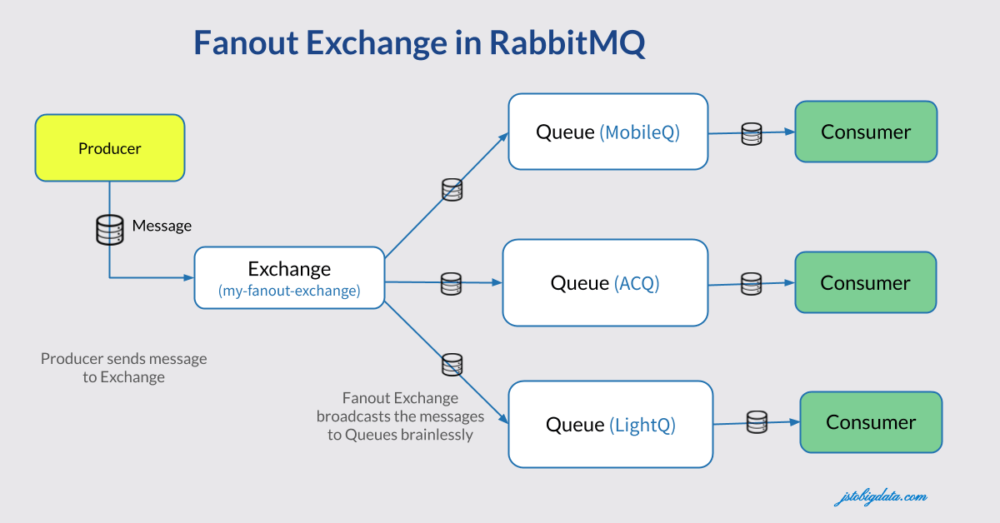

# Distributed Java drawing game with RabbitMQ and ngrok 

Welcome to Real-Time Drawing and Guessing Game! This program utilizes RabbitMQ message broker to facilitate seamless communication and distribution of data among players.

.png)

### Creating Rooms:
Players can create their own rooms, represented as exchanges inside the RabbitMQ broker. Each room acts as a hub where multiple players can connect and interact.

### Drawing and Broadcasting:
In each turn, a player is assigned a keyword to draw. They unleash their creativity and sketch their interpretation of the word. These drawings are then broadcasted in real-time to all other users connected to the same exchange via a fanout mechanism.



### Guessing the Word:
As the drawing unfolds, players are given hints in the form of the number of lines representing the number of letters in the word being drawn. They can submit their guesses in the chat next to the painting. When someone correctly guesses the word, they earn points!

### ngrok:
Ngrok is a cross-platform application that allows developers to expose their local web servers to the internet. It hosts a local web server on its own sub-domain and makes your local development box available on the internet through Tunnelling. Ngrok is a great tool when it comes to testing local applications as if they were hosted on a server. You can use it to test applications in collaboration with other developers or testers, users, and stakeholders without having to deploy your application to an environment.

<i>read ppt file from above to understand the idea of a project.</i>


# Getting Started

- install and configure RabbitMQ as a service

- Clone this repository to your local machine.

- install ngrock

- make this yml configuration file 

```yml
version: "2"
authtoken: 1pkgmYykxTpPLnhZoS6ufSGFIwe_cNzNqjfSFLX5mYmZkT7A
tunnels:
  first:
    addr: localhost:15672
    proto: http   
  second:
    addr: localhost:5672
    proto: tcp
```
- open ngrock and type the following: 
```sh
ngrok start --all --region eu
```

This command uses the yml configuration from above in the background. By employing the --region flag, you can select the datacenter nearest to your location. If you are for example from Germany, 
you should be using the EU region to minimize any latency. This setup facilitates hosting the application using ngrok, enabling the simulation of real-time functionality. For a comprehensive list of available regions suitable for tunneling, refer to <a href="https://ngrok.com/docs/network-edge/#points-of-presence">this link</a>.

- after running the command copy the output parameters from the terminal inside CNF and JoinRoom classes  

- run the program from eclipse IDE and start creating rooms, drawing, guessing, and earning points 🎨✨
